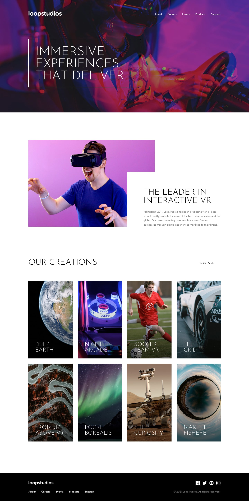

# Frontend Mentor - Loopstudios Landing Page Solution

This is a solution to the [Loopstudios landing page challenge on Frontend Mentor](https://www.frontendmentor.io/challenges/loopstudios-landing-page-N88J5Onjw). Frontend Mentor challenges help you improve your coding skills by building realistic projects.

## Table of Contents

- [Overview](#overview)
  - [The Challenge](#the-challenge)
  - [Screenshot](#screenshot)
  - [Links](#links)
- [My Process](#my-process)
  - [Built With](#built-with)
  - [What I Learned](#what-i-learned)
  - [Continued Development](#continued-development)
- [Author](#author)

## Overview

### The Challenge

Users should be able to:

- View the optimal layout for the site depending on their device's screen size
- See hover states for all interactive elements on the page

### Screenshot

  
  

### Links

- Solution URL: [Add solution URL here](https://github.com/CasperTheChild/LoopStudio)
- Live Site URL: [Add live site URL here](https://casperthechild.github.io/LoopStudio/)

## My Process

### Built With

- Semantic HTML5 markup
- CSS custom properties
- Flexbox
- CSS Grid
- Mobile-first workflow
- [Bootstrap](https://getbootstrap.com/) - Bootstrap framework
- [Sass](https://sass-lang.com/) - Sass preprocessor

### What I Learned

I've tried using the Sass preprocessor for the first time. However, I don't see any benefits since I am already using Bootstrap.

### Continued Development

I'll keep practicing the Sass preprocessor.

## Author

- Frontend Mentor - [@yourusername](https://www.frontendmentor.io/profile/yourusername)
